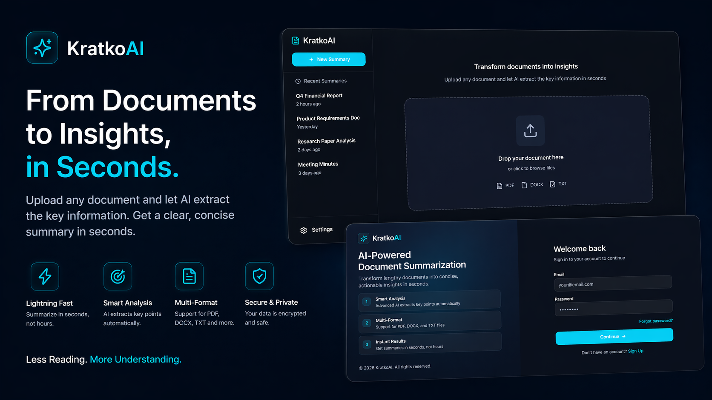

# KratkoAI



KratkoAI is a full-stack app for summarizing documents with AI. Users can register, upload a `.txt`, `.pdf`, or `.docx` file, and get a structured summary generated through OpenRouter.

## Features

- Upload and summarize documents
- Support for `txt`, `pdf`, and `docx`
- JWT authentication
- Personal upload history per user
- Retry failed or completed processing

## Stack

### Frontend

- React
- TypeScript
- Vite
- Tailwind CSS

### Backend

- Django
- Django REST Framework
- Simple JWT
- SQLite
- OpenAI SDK with OpenRouter
- `pypdf`
- `python-docx`

## Project Structure

```text
kratko-ai/
  back/
    api/
    summarizer/
    manage.py
    requirements.txt
  front/
    src/
    package.json
    vite.config.ts
  poster.png
  run.bat
```

## Environment

Create `back/.env`:

```env
SECRET_KEY=your-django-secret-key
DEBUG=True
OPENROUTER_API_KEY=your-openrouter-api-key
OPENROUTER_MODEL=openrouter/free
```

Optional:

```env
OPENROUTER_FALLBACK_MODELS=model-a,model-b
```

## Run

### Quick start on Windows

```bash
run.bat
```

### Backend

```bash
cd back
python -m venv .venv
.\.venv\Scripts\activate
pip install -r requirements.txt
python manage.py migrate
python manage.py runserver
```

Backend: `http://127.0.0.1:8000`

### Frontend

```bash
cd front
npm install
npm run dev
```

Frontend: `http://localhost:5173`

## API

| Method | Endpoint | Purpose |
| --- | --- | --- |
| `POST` | `/api/register/` | Register a user |
| `POST` | `/api/login/` | Login with email or username |
| `POST` | `/api/token/refresh/` | Refresh JWT token |
| `GET` | `/api/uploads/` | List user uploads |
| `POST` | `/api/uploads/` | Upload and summarize a file |
| `GET` | `/api/uploads/:id/` | Get one summary |
| `POST` | `/api/uploads/:id/retry/` | Re-run processing |
